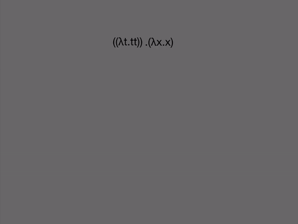

# Formality-Core

An optimal compilation target for functional programming languages. It is:

1. **Optimal:** compatible with interaction combinators, no bookkeeping/oracle needed.

2. **GC-free:** memory is freed when values go out of scope.

3. **Parallel:** can be evaluated in GPUs, FGPAs and similar.

4. **Efficient:** 128 bits per lambda/pair, unboxed 32-bit ints, constant-time beta-reduction.

5. **Terminating:** computations are guaranteed to halt in elementary time.

6. **Simple:** the entire implementation (all included) takes about 1.5k lines of code.

It features affine lambdas, elementary duplication ("cloning"), 32-bit numeric primitives and pairs.

## Example

This example computes the nth number of the Fibonacci sequence. It uses compact λ-encoded nats to emulate loops.

```javascript
// Gets the nth number of the Fibonacci sequence
def fib: [n]
  let init = &(0,1)
  let loop = [state]
    get &(a, b) = state
    get &(x, y) = cpy b
    &(x, {a + y})
  let stop = [state]
    (snd state)
  (for n #init #loop #stop)
```

Here is a table showing how many graph rewrites it takes for it to compute `fib(n)`:

n | fib(n) % 2^32 | graph rewrites
--- | --- | ---
1000 | 1318412525 | 6116
2000 | 3779916130 | 12124
3000 | 628070097 | 18139
4000 | 45579869 | 24132
5000 | 2020817954 | 30133
6000 | 1434712737 | 36147
7000 | 1424409805 | 42147
8000 | 1154982114 | 48140

As you can see, `fib(n)` is linear, and needs exactly 6 graph rewrites per iteration of the loop. This JS implementation performs roughly `3m` rewrites/s. We expect this to increase a few orders of magnitude with compilers and hardware.

For more examples, check [main.fmc](main.fmc).

## Usage

1. Install it with npm:

```
npm i -g formality-core
```

2. Type `fmc` to see a list of options and test in our example:

```
git clone https://github.com/moonad/formality-core.git
cd formality-core
fmc -s main
```

For a reference of the language features, check our [wiki](https://github.com/moonad/formality-core/wiki).

## Theory

Formality-Core is based on the [Elementary Affine Calculus](https://github.com/moonad/elementary-affine-calculus), extended with numeric primitives and pairs. It is compiled to a lightweight interaction net system based on [Symmetric Interaction Combinators](https://pdfs.semanticscholar.org/1731/a6e49c6c2afda3e72256ba0afb34957377d3.pdf) for evaluation, as shown below:



To learn more about optimal evaluators and how they relate to traditional functional languages, check [this Reddit post](https://www.reddit.com/r/haskell/comments/bp55ua/new_tool_for_exploring_optimal_reductions/enr3d42/).
